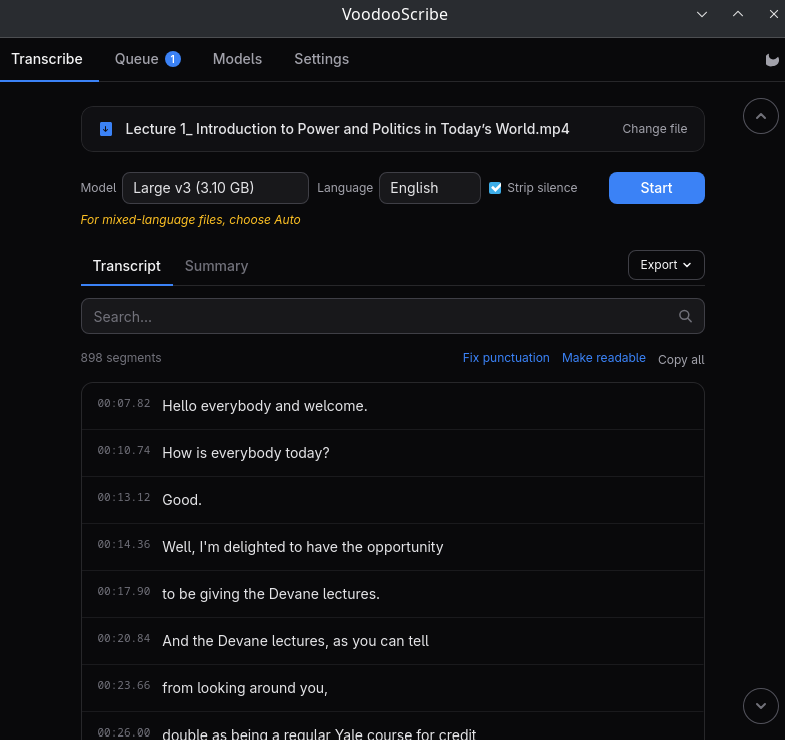
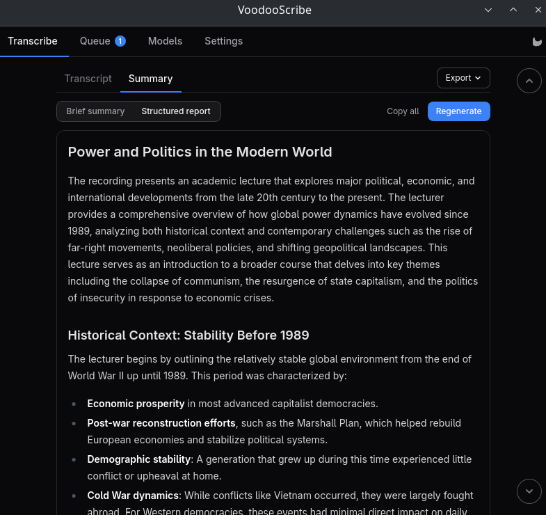
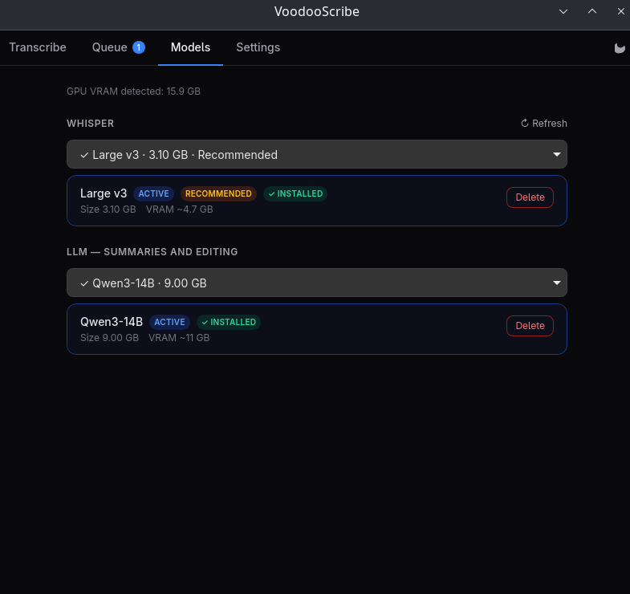

<div align="center">


# VoodooScribe

**Transcribe audio and video entirely on your own machine.**

No cloud. No account. No API key. Nothing ever leaves your device.

[](LICENSE)
[](docs/BUILDING.md)
[](https://tauri.app)



</div>

---

VoodooScribe is a desktop transcription app built around [whisper.cpp](https://github.com/ggerganov/whisper.cpp)
and [llama.cpp](https://github.com/ggml-org/llama.cpp). It turns recordings — interviews, lectures,
meetings, voice notes — into timecoded, searchable, exportable text, and it does all of it locally
on your GPU.

Most transcription tools upload your recording to somebody else's server. This one has no server to
upload to. The models run on your hardware, the files stay in your filesystem, and the app works
with the network cable unplugged (once the models are downloaded).

## Features

**Transcription**
- Whisper models from tiny to large-v3, GPU-accelerated — Vulkan on Linux/Windows, Metal on macOS
- Automatic language detection, including **mixed-language recordings**: the language is re-detected
  per speech window, so a Russian conversation with English terms in it transcribes correctly
- Built-in [Silero VAD](https://github.com/snakers4/silero-vad) speech detection, which suppresses the
  classic Whisper hallucinations over silence ("Thanks for watching!" and friends)
- Honest progress reporting — separate `decoding` / `loading` / `transcribing` phases with a live
  heartbeat, so a slow file is visibly different from a stuck one
- Cancel at any stage, including mid-inference

**Understanding the result**
- Timecoded segments; click any line to copy it
- Search box with case-insensitive filtering and highlighting
- **Summarize** — a plain-language summary in two modes (brief or structured), generated locally by a
  Qwen3 model of your choice
- **Fix punctuation** and **Make readable** — two passes that clean up whisper's raw output line by
  line. Both return the same segments, in the same order, with the same timecodes: only the text
  changes, so the cleaned-up view stays searchable, copyable line by line, and exportable in every
  transcript format. *Fix punctuation* adds punctuation and capitals and drops filler words, leaving
  the words themselves as they were spoken. *Make readable* does that and also fixes agreement, case
  endings, verb forms and word order — which matters in inflected languages, at the price of no
  longer being a literal record.



**Getting it out**
- Transcript export: `txt`, `srt`, `vtt`, `md`, `json`, `docx`
- Summary export: `md`, `txt`, `docx`
- Copy all, with or without timestamps

**Everything else**
- Batch queue that actually processes files one after another, not just a history list
- Model manager with resumable downloads, pause/cancel, and a custom models directory
- Model recommendations based on your **free** VRAM (and on system RAM for CPU-only machines),
  with plain-language errors when a model will not fit
- Drag-and-drop or file picker, 30+ audio and video formats
- Interface in English, Chinese (Simplified), French, German, Portuguese (Brazil), Russian and Spanish

## Supported formats

Common containers and codecs are decoded in-process by [Symphonia](https://github.com/pdeljanov/Symphonia).
Everything else falls back to a bundled FFmpeg sidecar, so in practice anything you can play, you can transcribe:

```
mp3  mp4  wav  ogg  oga  flac m4a  m4b  mkv  mka
webm aac  opus mov  avi  wma  amr  3gp  aiff aif
caf  wv   ac3  dts  mpg  mpeg ts   flv  wmv  m4v  spx
```

## Models

Models are downloaded on first run from Hugging Face into the application data directory. No speech
or language model is bundled with the app; what does ship inside it is the 865 KB voice-activity
detector and an FFmpeg binary for the formats Symphonia cannot decode.

| Model | Download | VRAM needed | Notes |
|---|---:|---:|---|
| Whisper Tiny | 78 MB | 390 MB | Fastest, lowest quality |
| Whisper Base | 148 MB | 500 MB | |
| Whisper Small | 488 MB | 1.0 GB | Good balance on modest GPUs |
| Whisper Medium | 1.53 GB | 2.6 GB | |
| Whisper Large v3 Turbo (Q5) | 574 MB | 1.2 GB | Turbo, quantized |
| Whisper Large v3 Turbo | 1.62 GB | 2.2 GB | Distilled 4-layer decoder: fast, slightly weaker on hard audio |
| **Whisper Large v3 (Q5)** | 1.08 GB | 2.4 GB | **Recommended on most cards** — full decoder at a third the size |
| Whisper Large v3 | 3.1 GB | 4.7 GB | Best quality available |
| Qwen3-4B (Q4_K_M) | 2.5 GB | 4.0 GB | Optional, only for the summary and readability passes |
| Qwen3-8B (Q4_K_M) | 5.03 GB | 6.5 GB | Optional, same jobs — better grammar in inflected languages |
| Qwen3-14B (Q4_K_M) | 9.0 GB | 11 GB | Optional, same jobs — best grammar, needs a large card |

The app picks a recommendation for you based on detected VRAM — up to Large v3 on a card that can
hold it — and warns you when a model needs more memory than you have. You can always override the
choice or point the app at your own `ggml-*.bin` file.



## Installing

Packages are published on the [Releases](../../releases) page, built by CI for every platform:
`.deb`, `.rpm` and `.AppImage` for Linux, `.msi`/`.exe` for Windows, `.dmg` for macOS.

Only the Linux packages have been run by the author. The Windows and macOS artifacts are compiled and
bundled by CI but nobody has launched them yet — see [Project status](#project-status).

To run at usable speed you need a working GPU driver with **Vulkan** (Linux/Windows) or **Metal**
(macOS). On Linux that means the `vulkan-icd-loader` package plus your vendor driver. Without a GPU
the app still runs on CPU and will recommend a smaller model accordingly.

Building from source is documented in **[docs/BUILDING.md](docs/BUILDING.md)**.

## Usage

Drop a file onto the window (or pick one), choose a model and language, press **Transcribe**. The
first run walks you through downloading a model.

There is also a small command-line mode, mostly useful for scripting and debugging:

```bash
voodooscribe transcribe recording.m4a --model ~/.local/share/com.voodooscribe.app/models/ggml-large-v3-turbo.bin --lang ru --vad
```

| Flag | Meaning |
|---|---|
| `--model`, `-m` | Path to a `ggml-*.bin` Whisper model (required) |
| `--lang`, `-l` | Language code, e.g. `en`, `ru`; omit for auto-detection |
| `--vad` | Enable Silero voice-activity detection |

## Where your data lives

| What | Path (Linux) |
|---|---|
| Models | `~/.local/share/com.voodooscribe.app/models/` |
| Settings | `~/.config/com.voodooscribe.app/` |

On Windows and macOS these follow the platform conventions for the `com.voodooscribe.app` identifier.
Transcripts are never written anywhere until you explicitly export them.

## Project status

1.0.0 is the first public release. The pipeline works end to end, the test suite is green and the app
has been in daily use on Linux throughout development, but you should know:

- **Developed and tested on Linux.** CI builds Windows and macOS packages, but no one has run them
  yet. If you try one, reports are very welcome.
- No speaker diarization (see [docs/ARCHITECTURE.md](docs/ARCHITECTURE.md#deliberate-non-goals) for why).
- Summaries come from a local model, 4B by default. It occasionally paraphrases loosely; it is a
  reading aid, not a record.

## Documentation

- **[docs/BUILDING.md](docs/BUILDING.md)** — prerequisites and build instructions for all three platforms
- **[docs/ARCHITECTURE.md](docs/ARCHITECTURE.md)** — how the pipeline fits together, and why it is built this way
- **[CONTRIBUTING.md](CONTRIBUTING.md)** — development workflow and house rules
- **[CHANGELOG.md](CHANGELOG.md)** — release history

## License

VoodooScribe is free software under the **[GNU General Public License v3.0 or later](LICENSE)**.

Copyright (C) 2026 WarpCoreDev

Third-party components — whisper.cpp, llama.cpp, Tauri, Symphonia, FFmpeg, the Silero VAD model and
the downloadable Whisper/Qwen models — keep their own licenses, listed in
**[THIRD-PARTY-NOTICES.md](THIRD-PARTY-NOTICES.md)**.

> Binary releases bundle FFmpeg (LGPL, or GPL on macOS). As required by those licenses, each release
> must ship the corresponding FFmpeg source or a written offer to provide it.
